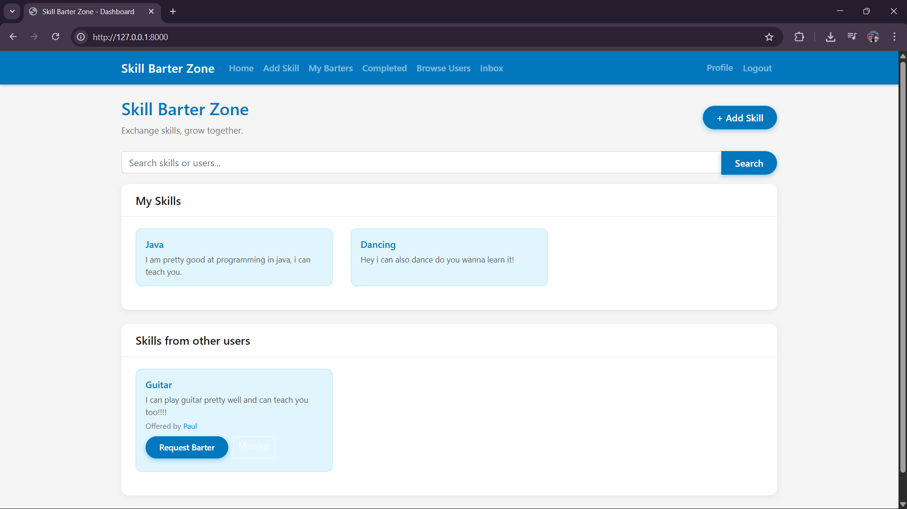
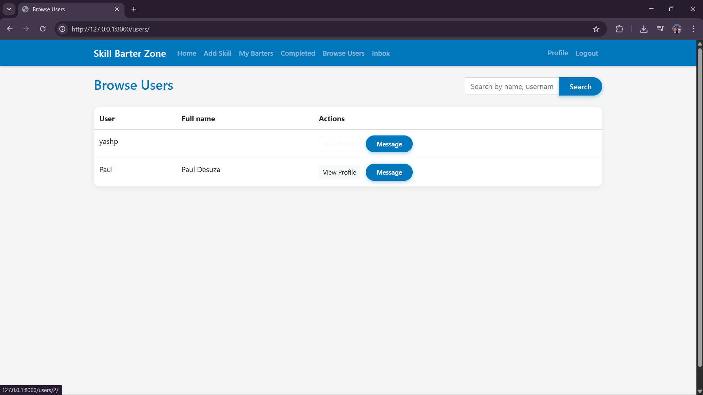
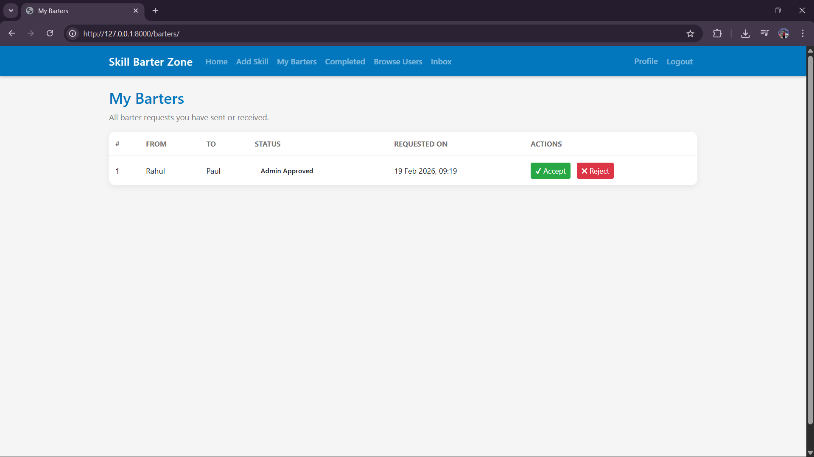
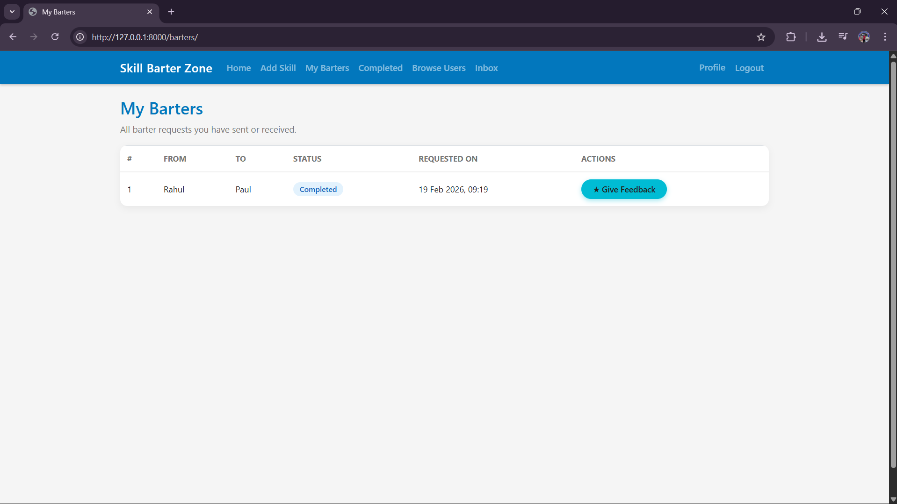
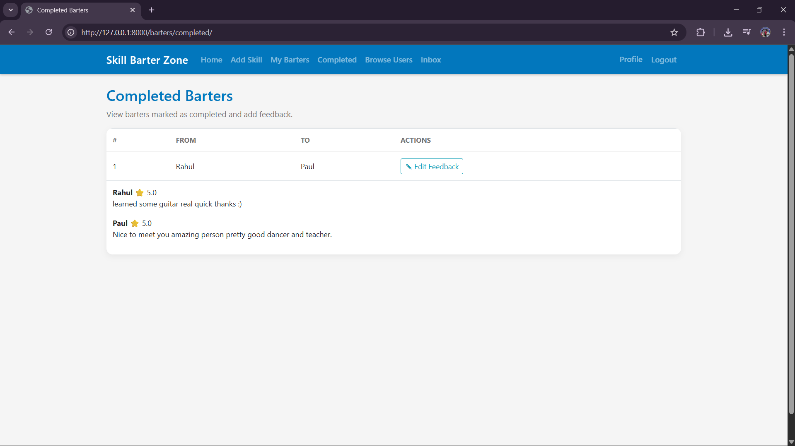

# 🚀 SkillBarterZone

A peer-to-peer **Skill Bartering Platform** built with Django where users can exchange skills instead of money.

---

## 📌 Overview

SkillBarterZone allows users to:

- Create profiles
- Add and showcase skills
- Send and manage barter requests
- Chat with other users
- Complete barters
- Leave ratings and feedback

This project demonstrates full-stack development using Django and SQLite.

---

## 🛠 Tech Stack

- **Backend:** Python, Django
- **Frontend:** HTML, CSS, Django Templates
- **Database:** SQLite
- **Authentication:** Django Built-in Auth System

---

## ✨ Features

### 👤 User Management
- User registration & login
- Profile management with profile picture
- View other users' profiles

### 🎯 Skill System
- Add new skills
- Browse available skills
- View skills by user

### 🔄 Barter System
- Send barter requests
- Accept / Reject requests
- Mark barter as completed
- View active and completed barters

### 💬 Messaging System
- Private conversations between users
- Inbox interface

### ⭐ Feedback System
- Leave ratings after barter completion
- Prevent duplicate feedback

### 🔐 Admin Panel
- Manage users, skills, barters, and feedback

---

## 📂 Project Structure

```
SkillBarterZone/
│
├── manage.py
├── db.sqlite3
├── requirements.txt
│
├── skillzone/
│   ├── models.py
│   ├── views.py
│   ├── urls.py
│   ├── admin.py
│   ├── templates/
│   └── migrations/
│
├── templates/
├── media/
└── assets/
```

---

## ⚙️ Installation

### 1️⃣ Clone Repository

```bash
git clone https://github.com/your-username/SkillBarterZone.git
cd SkillBarterZone
```

### 2️⃣ Create Virtual Environment

```bash
python -m venv venv
```

Activate (Windows):

```bash
venv\Scripts\activate
```

Activate (Mac/Linux):

```bash
source venv/bin/activate
```

### 3️⃣ Install Dependencies

```bash
pip install -r requirements.txt
```

### 4️⃣ Run Migrations

```bash
python manage.py migrate
```

### 5️⃣ Create Superuser (Optional)

```bash
python manage.py createsuperuser
```

### 6️⃣ Run Server

```bash
python manage.py runserver
```

Open in browser:

```
http://127.0.0.1:8000/
```

Admin panel:

```
http://127.0.0.1:8000/admin/
```

---

## 📸 Screenshots

### 🏠 Dashboard


---

### 👥 Browse Users


---

### 🔄 Accept / Reject Barters


---

### 💬 Messaging System


---

### ✅ Completed Barters


---

### ⭐ Feedback & Ratings



---

## 🔒 Environment Notes

- Default database: SQLite
- For production:
  - Use PostgreSQL
  - Set `DEBUG = False`
  - Configure proper `SECRET_KEY`
  - Configure `MEDIA_ROOT`

---

## 🎓 Learning Outcomes

- Django ORM relationships
- Authentication system
- CRUD operations
- Messaging workflow
- File uploads
- Template rendering

---

## 📄 License

This project is for educational purposes.
